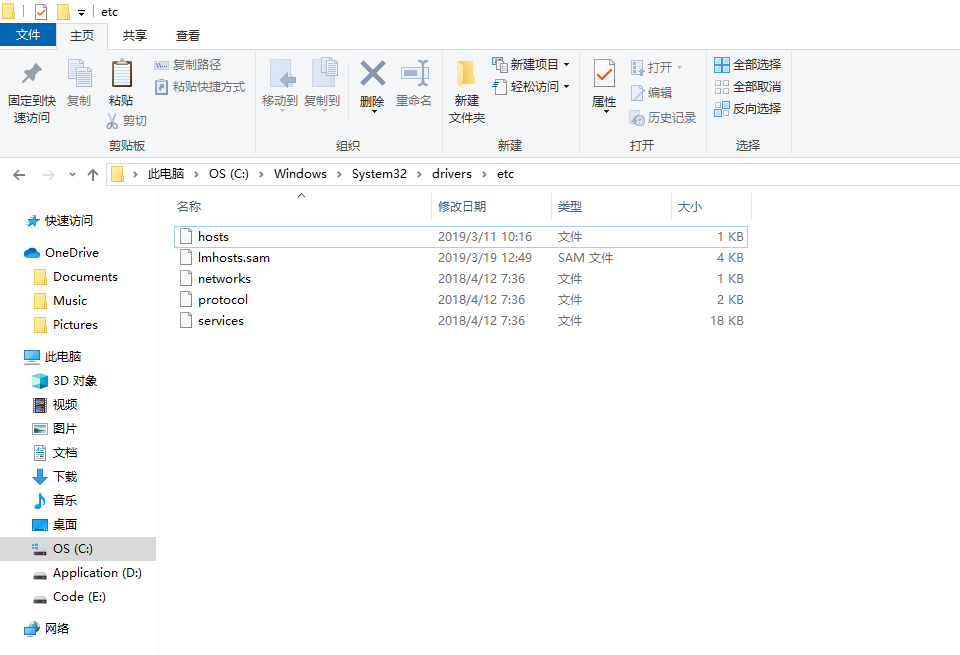
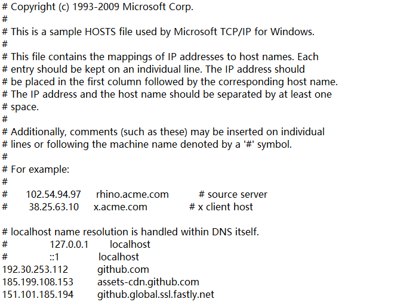
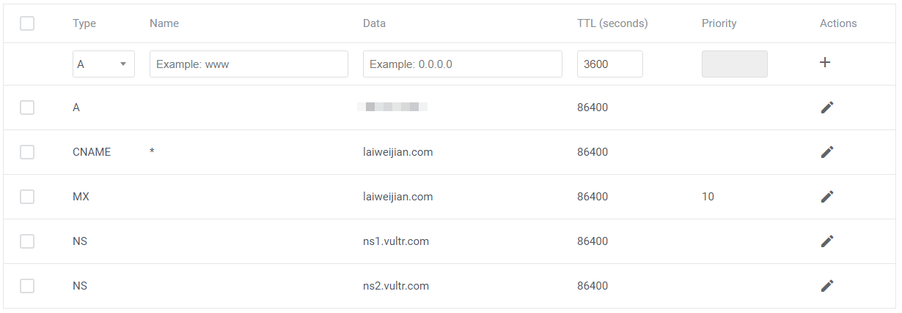

# 页面呈现、重绘和回流

## 呈现

**首先得了解从输入 url 到页面最终显示出来的这段过程发生了什么：**

1. 在地址栏中输入 url；

2. 浏览器首先查看浏览器缓存 -> 系统缓存 -> 路由器缓存。若缓存中有对应文件，则直接返回对应的文件，若没有，跳转第三步；

3. 解析 url，如果是一个域名，先进行 [DNS 解析](#dns-解析过程)，获取相应的 ip；

4. 浏览器向服务器发起 tcp 连接，建立`三次握手`；

5. 握手成功后，浏览器向服务器发送 http 请求，请求数据包；

6. 服务器接收到请求，处理并返回数据；

7. 浏览器收到服务器的 http 响应；

8. 读取页面内容，解析源码；

9. 构建 dom 树和样式结构体；

10. 根据 dom 树和样式结构体生成 render 树；

11. 根据 render 树许安然处最终页面。

**浏览器获取到 HTML 文件后对文件进行解析：**

1. 浏览器把获取到的 html 代码解析成 1 个 dom 树，html 中的每个 tag 都是 dom 树中的 1 个节点，根节点就是我们常用的 document 对象(html)。dom 树就是我们调试时看到的 html 结构，里面包含了所有的 html 元素，包括`display:none`隐藏的元素，还有用 JS 动态添加的元素等；

2. 浏览器把所有样式(主要包括 css 和浏览器的样式设置)解析成样式结构体，在解析的过程中会去掉浏览器不能识别的样式，比如 IE 会去掉-moz 开头的样式，而 firefox 会去掉`_`开头的样式。

3. dom tree 和样式结构体结合后构建呈现树(render tree),render tree 有点类似于 dom tree，但其实区别有很大，render tree 能识别样式，render tree 中每个 node 都有自己的 style，而且 render tree 不包含隐藏的节点(比如 `display:none` 的节点，还有 head 节点)，因为这些节点不会用于呈现，而且不会影响呈现的，所以就不会包含到 render tree 中。注意:`visibility:hidden` 隐藏的元素还是会包含到 render tree 中的，因为 `visibility:hidden` 会影响布局(layout)，会占有空间。根据 css2 的标准，render tree 中的每个节点都称为 `box(Box dimensions)`，box 所有属性：width,height,margin,padding,left,top,border 等。

4. 一旦 render tree 构建完毕后，浏览器就可以根据 render tree 来绘制页面了。

## 重绘

当 render tree 中的一些元素需要更新属性，而这些属性只是影响元素的外观，风格，而不会影响布局的，比如 background-color。则称为重绘。

## 回流

当 render tree 中的一部分(或全部)因为元素的规模尺寸，布局，隐藏等改变而需要重新构建（重新布局）。这就称为回流。每个页面至少需要一次回流，就是在页面第一次加载的时候。

::: tip
回流一定重绘，重绘不一定回流。
:::

## 什么操作会引起页面重绘、回流

任何对 render tree 中元素的操作都会引起回流或重绘：

-   添加、删除元素（回流 + 重绘）；
-   隐藏/显示元素：display：none （回流 + 重绘）， visibility:hidden (重绘)；
-   移动元素至另一节点内（回流 + 重绘）；
-   移动元素，改变元素 top,left 属性或 jquery 的 animate 方法（重绘，不一定回流）；
-   修改元素样式（重绘，不一定回流）；
-   用户手动改变浏览器大小，字体大小（回流 + 重绘）；
-   ...

回流比重绘的代价要更高，回流的花销跟 render tree 有多少节点需要重新构建有关系，假设你直接操作 body，比如在 body 最前面插入 1 个元素，会导致整个 render tree 回流，这样代价当然会比较高，但如果是指 body 后面插入 1 个元素，则不会影响前面元素的回流。

```js
var style = document.body.style;

style.padding = '2px'; // 回流 + 重绘
style.border = '1px solid red'; // 再一次 回流 + 重绘
style.color = 'blue'; // 再一次重绘
style.backgroundColor = '#ccc'; // 再一次重绘
style.fontSize = '14px'; // 再一次 回流 + 重绘

// 添加node，再一次 回流 + 重绘
document.body.appendChild(document.createTextNode('abc!'));
```

## 如何减少回流、重绘

减少回流、重绘其实就是需要减少对 render tree 的操作，并减少对一些 style 信息的请求，尽量利用好浏览器的优化策略。具体方法有：

-   不要 1 个 1 个改变元素的样式属性，最好直接改变 className，但 className 是预先定义好的样式，不是动态的，如果你要动态改变一些样式，则使用 cssText 来改变，见下面代码：

```js
// 不好的写法
var left = 1;
var top = 1;
el.style.left = left + 'px';
el.style.top = top + 'px';

// 比较好的写法
el.className += ' className1';

// 比较好的写法
el.style.cssText += '; left: ' + left + 'px; top: ' + top + 'px;';
```

-   让要操作的元素处理完后一起更新，即让元素不存在于 render tree 中，

    -   使用 `documentFragment` 或 div 等元素进行缓存操作，这个主要用于添加元素的时候，就是先把所有要添加到元素添加到 1 个 div(这个 div 也是新加的)，
        最后才把这个 div append 到 body 中。
    -   先 display:none 隐藏元素，然后对该元素进行所有的操作，最后再显示该元素。因对 display:none 的元素进行操作不会引起回流、重绘。所以只要操作只会有 2 次回流 + 重绘。

-   不要经常访问会引起浏览器 flush 队列的属性，如果确实要访问，就先读取到变量中进行缓存，以后用的时候直接读取变量就可以了：

```js
// 不好的写法，每次遍历都会去重新获取el的属性
for(循环) {
    el.style.left = el.offsetLeft + 5 + "px";
    el.style.top  = el.offsetTop  + 5 + "px";
}

// 这样写好点
var left = el.offsetLeft, top  = el.offsetTop, s = el.style;
for(循环) {
    left += 10;
    top  += 10;
    s.left = left + "px";
    s.top  = top  + "px";
}
```

-   考虑你的操作会影响到 render tree 中的多少节点以及影响的方式，影响越多，花费肯定就越多。

## DNS 解析过程

当一个用户在地址栏输入 www.taobao.com 时，DNS 解析有大致十个过程，如下：

1. 浏览器先检查自身缓存中有没有被解析过的这个域名对应的 ip 地址，如果有，解析结束。同时域名被缓存的时间也可通过`TTL`属性来设置。
2. 如果浏览器缓存中还没命中，浏览器会检查操作系统缓存中有没有对应的已解析过的结果。而操作系统也有一个域名解析的过程。通过`C:\Windows\System32\drivers\etc`下的 hosts 文件来设置，如果你在这里指定了一个域名对应的 ip 地址，那浏览器会首先使用这个 ip 地址。





但是这种操作系统级别的域名解析规程也被很多黑客利用，通过修改你的 hosts 文件里的内容把特定的域名解析到他指定的 ip 地址上，造成所谓的`域名劫持`。所以在 windows7 中将 hosts 文件设置成了`readonly`，防止被恶意篡改。

3. 如果至此还没有命中域名，才会真正的请求本地域名服务器（LDNS）来解析这个域名，这台服务器一般在你的城市的某个角落，距离你不会很远，并且这台服务器的性能都很好，一般都会缓存域名解析结果，大约 80%的域名解析到这里就完成了。
4. 如果 LDNS 仍然没有命中，就直接跳到根域名服务器 Root Server 请求解析
5. Root Server 返回给 LDNS 一个所查询域的主域名服务器（gTLD Server，国际顶尖域名服务器，如.com .cn .org 等）地址
6. 此时 LDNS 再发送请求给上一步返回的 gTLD
7. 接受请求的 gTLD 查找并返回这个域名对应的 Name Server 的地址，这个 Name Server 就是网站注册的域名服务器
8. Name Server 根据映射关系表找到目标 ip，返回给 LDNS
9. LDNS 缓存这个域名和对应的 ip
10. LDNS 把解析的结果返回给用户，用户根据 TTL 值缓存到本地系统缓存中，域名解析过程至此结束



::: tip
TTL(Time To Live): 表示一条域名解析记录在 DNS 服务器上的缓存时间。数值越小，修改记录各地生效时间越快。
:::
