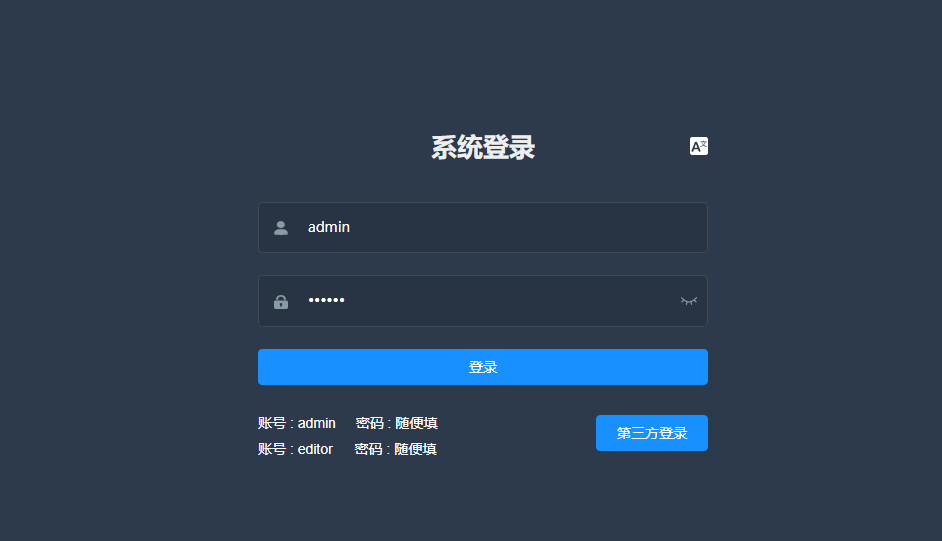

# vue-i18n 国际化

`vue-element-admin`<Badge text="v4.1.0-" /> 默认提供了国际化，因大部分用户其实是用不到国际化的，但移除国际化工作量又相当的大。故在<Badge text="v4.1.0+" />版本之后不再提供国际化，如有国际化的需求可以参考`vue-element-admin`[i18n 分支](https://github.com/PanJiaChen/vue-element-admin/tree/i18n)。




## 安装

```sh
npm install vue-i18n
```

## 全局配置

在`src`目录下新建文件夹`lang`，用于配置各种语言：

```
 +---Lang
    |   \---en.js
    |   \---index.js
    |   \---zh.js
```

在 index.js 中引入语言配置文件，并使用`cookie`缓存当前选中的语言设置：

```js
import Vue from 'vue';
import VueI18n from 'vue-i18n';
import Cookies from 'js-cookie';
import enLocale from './en';
import zhLocale from './zh';

// 如果用到了其他的 UI 框架,在鬼计划的同时也要将 UI 框架国际化
import elementEnLocale from 'element-ui/lib/locale/lang/en'; // element-ui lang
import elementZhLocale from 'element-ui/lib/locale/lang/zh-CN'; // element-ui lang

Vue.use(VueI18n);

const messages = {
    en: {
        ...enLocale,
        ...elementEnLocale,
    },
    zh: {
        ...zhLocale,
        ...elementZhLocale,
    },
};

export function getLanguage() {
    const chooseLanguage = Cookies.get('language');
    if (chooseLanguage) return chooseLanguage;

    // if has not choose language
    const language = (
        navigator.language || navigator.browserLanguage
    ).toLowerCase();
    const locales = Object.keys(messages);

    for (const locale of locales) {
        if (language.indexOf(locale) > -1) {
            return locale;
        }
    }

    return 'en';
}

const i18n = new VueI18n({
    // set locale
    // options: en | zh
    locale: getLanguage(),
    // set locale messages
    messages,
});

export default i18n;
```

在 main.js 中引入该文件，并挂载到 Vue 上：

```js
import i18n from './lang'; // internationalization

Vue.use(Element, {
    i18n: (key, value) => i18n.t(key, value),
});

new Vue({
    el: '#app',
    router,
    store,
    i18n,
    render: (h) => h(App),
});
```

## 使用

### 在 template 中使用

```html
<div class="title-container">
    <h3 class="title">
        {{ $t('login.title') }}
    </h3>
    <lang-select class="set-language" />
</div>
```

### 在 JS 中使用

不建议在 JS 中使用，因为这样需要监听语言环境的改变，否则当切换语言环境时页面并不会发生改变。

```js
export default {
    watch: {
        lang() {
            this.setOptions();
        },
    },
    methods: {
        setOptions() {
            this.options = [
                {
                    value: '1',
                    label: this.$t('i18nView.one'),
                },
                {
                    value: '2',
                    label: this.$t('i18nView.two'),
                },
                {
                    value: '3',
                    label: this.$t('i18nView.three'),
                },
            ];
        },
    },
};
```

具体配置参见 [vue-i18n](https://kazupon.github.io/vue-i18n/zh/)。
