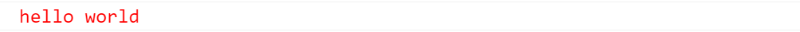
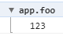
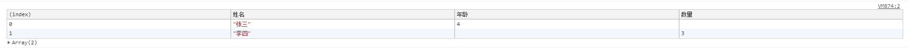
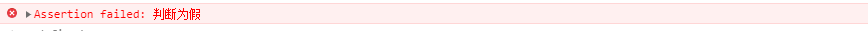
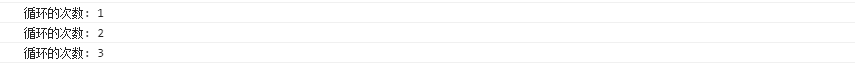
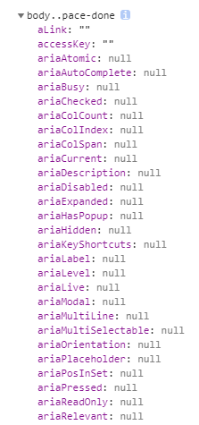
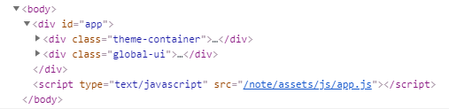
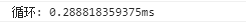

# console

## console.log

console.log 接收不定参数，参数间用逗号分隔，最终会输出会将它们以空白字符连接

```js
console.log('123', '456', '789') // 123 456 789
```

将对象所有属性一行输出

```js
console.log(JSON.stringify({ alpha: 'A', beta: 'B' }, null, '')) // {"alpha":"A","beta":"B"}
```

将对象所有属性多行输出

```js
console.log(JSON.stringify({ alpha: 'A', beta: 'B' }, null, '    '))
/* 
{
    "alpha": A,
    "beta": B
} 
*/
```

使用格式化指令 `%c` 可以对需要输出的文本进行样式调整：

```js
console.log('%chello world', 'font-size:25px;color:red;')
```



## console.group & console.groupEnd

可以使用 `console.group` 配合 `console.groupEnd` 做到分类输出:

```js
console.group('app.foo')
console.log('123')
console.groupEnd()
```



## console.table

使用 `console.table` 输出表格

```js
let data = [{ 姓名: '张三', 年龄: 4 }, { 姓名: '李四', 数量: 3 }]
console.table(data)
```



## console.assert

当你想代码满足某些条件时才输出信息到控制台，那么你大可不必写 if 或者三元表达式来达到目的，`cosole.assert` 便是这样场景下一种很好的工具，它会先对传入的表达式进行断言，只有表达式为假时才输出相应信息到控制台。

```js
console.assert(false, '判断为假')
console.assert(true, '判断为真')
```



## console.count

`console.count` 统计执行的次数：

```js
let i = 0
while (i < 3) {
  i++
  console.count('循环的次数')
}
```



## console.dir

将 DOM 结点以 JavaScript 对象的形式输出到控制台

```js
console.dir(document.body)
```



:::tip
`console.log` 是直接将该 DOM 结点以 DOM 树的结构进行输出，与在元素审查时看到的结构是一致的。
:::

```js
console.log(document.body)
```



## console.time & console.timeEnd

可以使用 `console.time` 与 `console.timeEnd` 来计算一段代码的执行时间。通过调用内置的 `console.time` 得到的结果要比自己手动计算的时间差更精确可靠。

```js
console.time('循环')
let i = 0
while (i < 10000) {
  i++
}
console.timeEnd('循环')
```



## console.profile & console.profileEnd

当想要查看 CPU 使用相关的信息时，可以使用 `console.profile` 配合 `console.profileEnd` 来完成这个需求。
这一功能可以通过 UI 界面来完成，Chrome 开发者工具里面有个 tab 便是 Profile。

## console.timeLine & console.timeLineEnd

与此 `console.profile` 类似, `console.timeLine` 配合 `console.timeLineEnd`,它的作用是开始记录一段时间轴，同样可以通过 Chrome 开发者工具里的 Timeline 标签来进行相应操作。

## console.trace

堆栈跟踪相关的调试可以使用 `console.trace`。这个同样可以通过 UI 界面完成。当代码被打断点后，可以在 Call Stack 面板中查看相关堆栈信息。
